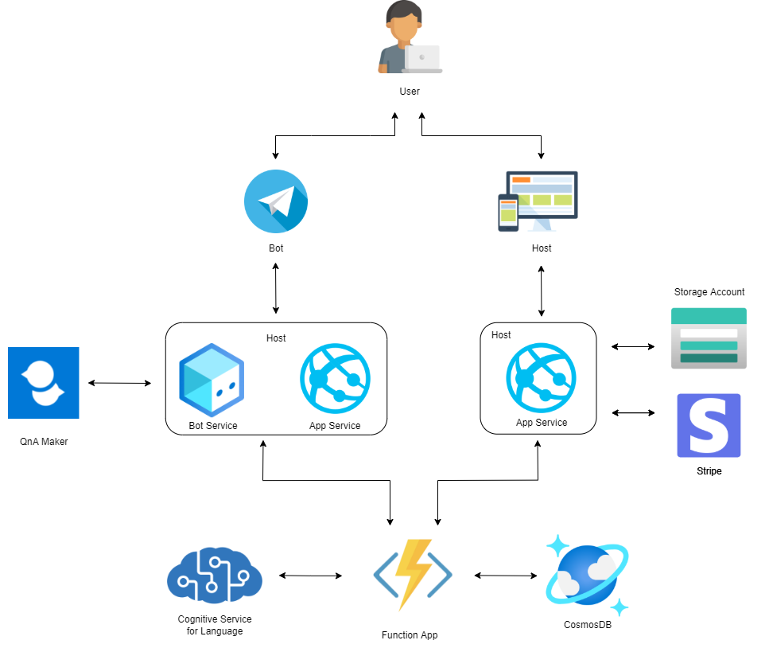

# NoteMarket
__NoteMarket__ is a project work for the Cloud Computing course, consisting in a  __Web Application__ with a __Telegram Bot__ companion, based on Microsoft Azure Cloud services.

# Architecture

# Dependencies
To launch the installation script and correctly deploy all resources the [Azure CLI](https://docs.microsoft.com/it-it/cli/azure/install-azure-cli) must be installed.

It's necessary to configure some cloud services by hand, due to the lack of support from the Azure CLI. More information can be found into the [Telegram Bot readme]().

# Installation
In order to simplify the installation process and grant portability, it's been created an __install bash script__.
Moreover, the steps for the instantiation of cloud resources have been reduced to the minimum.

Just make a copy of our repository... 
```bash
git clone https://github.com/antonio-cirillo/NoteMarket.git
```
...and launch the script from the terminal!
```bash
chmod +x ./install.sh
./install.sh
```